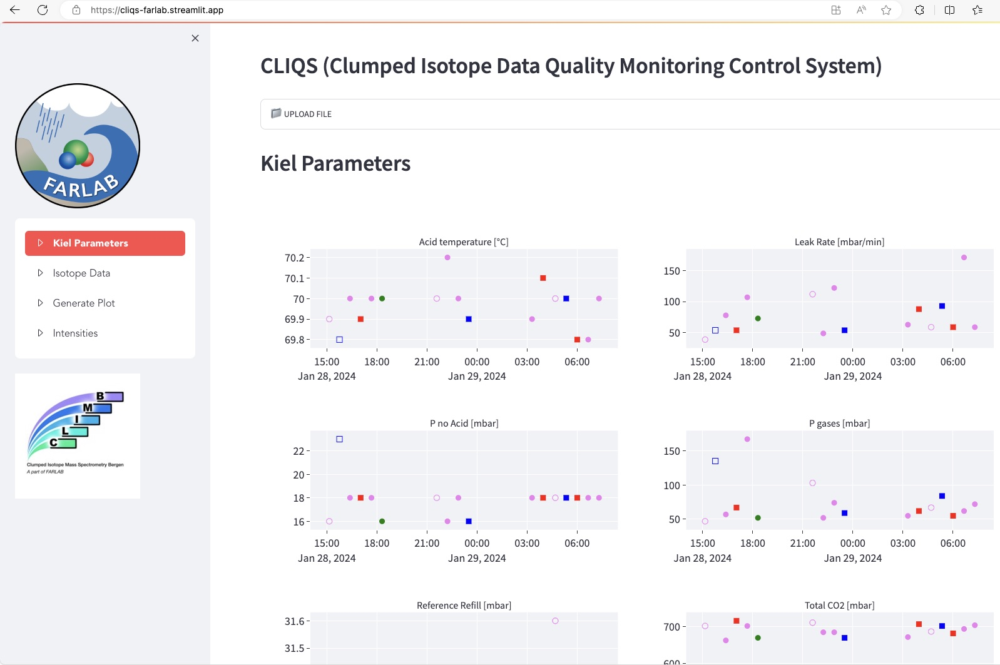

# CLIQS (Clumped Isotope Data Quality Monitoring) Web App

## Application
[CLIQS App](https://cliqs-farlab.streamlit.app/)

## Overview

This repository contains a Python-based web application for clumped isotope data quality monitoring. The application is built using [Streamlit](https://streamlit.io/) and includes functionality for data visualization and analysis related to climb isotope measurements at University of Bergen [FARLAB laboratory](https://www.uib.no/en/FARLAB) in Norway.

## Features

- **Kiel Parameters:** Explore Kiel parameters with interactive plots.
- **Isotope Data:** Visualize numeric columns of the isotope data.
- **Generate Plot:** Generate custom plots based on the loaded data.
- **Standards:** View plots related to isotope standards.
- **Intensities:** Analyze raw intensities, intensity stats, and intensity ratios.

## Getting Started

1. Install the required Python libraries:

   ```bash
   pip install streamlit streamlit_option_menu pandas numpy scipy plotly

## Clone repository
git clone [https://github.com/ealagoz/cliqs.git]

cd your-repository

## Run the Streamlit app
streamlit run main.py

## Usage
-- Upload climb instrument run export file (RunXXXX.xls) in the web app.
-- Explore different tabs for Kiel parameters, isotope data, generated plots, standards, and intensities.
-- Customize and generate plots under **Intensities** tab as needed.

## Screenshots


## Contributing
Contributions are welcome! 

## License
This project is licensed under the [MIT License](./LICENSE.md).
